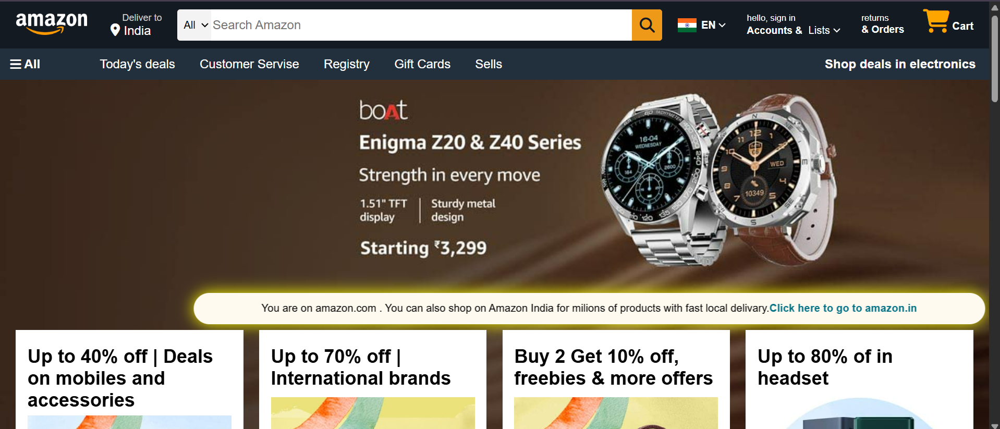

# 🛍️ Amazon Landing Page Clone

## This is a simple **Amazon.com landing page clone** built using **only HTML and CSS**. It was my **first ever web development project** after learning the basics of HTML and CSS.

## 🔗 Live Demo

👉 [https://amzonclone-partha.netlify.app/](https://amzonclone-partha.netlify.app/)

---

## 📸 Screenshots

| header | | footer |
| -------------------------------- | | -------------------------------- |
|  | ||  |

---

## 🚀 Features

- Header with logo, search bar, and navigation
- Hero section with promotional banner
- Product category boxes
- Footer with multiple columns (like the real Amazon site)

---

## 🛠️ Tech Stack

- HTML5
- CSS3

---

## 🧪 Getting Started

### 📦 Installation

Clone the repo :

```bash
git clone https://github.com/PARTHA-PATTANAYAK-02/Amazon_Clone.git
```

---

## 🌐 Deployment

## This project can be deployed easily using:

- ### 🔗 [netlify](https://amzonclone-partha.netlify.app/)

## ✍️ Author

**Made with ❤️ by [Partha Pattanayak](https://github.com/PARTHA-PATTANAYAK-02)**
